# Zimran-Back-end-test-task
[](https://nodesource.com/products/nsolid)
## Guide to run API
<a name="readme-top"></a>
## Quickstart

### Clone project

```bash
git clone https://github.com/AA19BD/QuizAPP.git
```
## Install Requirements

Create virtual environment for python
```shell
python3 -m venv venv
```

Activate environment
```shell
source venv/bin/activate
```

Install all the requirements.
Update pip before running install.
```shell
pip install --upgrade pip
```

```shell
pip install -r requirements-dev.txt
```

Change .env.example file to .env
 ```
SECRET_KEY=PPFGruWMnOBhFGQYftmNdgCmKRiaQOGwrmzdrupXdlHnUhZLah
ENVIRONMENT=DEV
ACCESS_TOKEN_EXPIRE_MINUTES=11520
REFRESH_TOKEN_EXPIRE_MINUTES=40320
BACKEND_CORS_ORIGINS=["http://localhost:3000","http://localhost:8001"]
ALLOWED_HOSTS=["localhost", "127.0.0.1"]

DEFAULT_DATABASE_HOSTNAME=localhost
DEFAULT_DATABASE_USER=postgres
DEFAULT_DATABASE_PASSWORD=pszkZVShCfPljpWpXFKiyuOnWgwYPPzFWdVIuErpZsgRrPXSRw
DEFAULT_DATABASE_PORT=4411
DEFAULT_DATABASE_DB=postgres

TEST_DATABASE_HOSTNAME=localhost
TEST_DATABASE_USER=postgres
TEST_DATABASE_PASSWORD=VvbkGDbEfdaoVjUBEJwKKxynjIRsZPssVomdYZxLBxxgkZBeZZ
TEST_DATABASE_PORT=30206
TEST_DATABASE_DB=postgres

FIRST_SUPERUSER_EMAIL=example@example.com
FIRST_SUPERUSER_PASSWORD=dsjElevlmwpjQwpVoFNC
```

## Run docker for Postgres DB
Run docker container
```shell
docker-compose up -d
```
Do migrations and initialize with initial_data.py script

```
bash init.sh
```

```
### You can look at the source code of the file, it will just run two commands:
###    - alembic upgrade head (to do migrations)
###    - python -m app.initial_data (to add some start data)
```

### Now you can run app

```shell
uvicorn app.main:app --reload
```

###  Activate pre-commit

[pre-commit](https://pre-commit.com/) is de facto standard now for pre push activities like isort or black.

It will format and notify about minor errors like extra whitespaces when you do git commit to your changes automatically.

```bash
# Install pre-commit
pre-commit install

# Run formatting
pre-commit run --all-files
```

### Running tests
```
pytest
```


### Create and apply alembic migration
Every time we modify model.py file, we should do this step. It will automatically create scripts to modify actual postgres database to reflect changes in model.py.

NOTE: scripts will be autogenerated, their should be enough for most cases.

```bash
### Use below commands in root folder in virtualenv ###

# if you see FAILED: Target database is not up to date.
# first use "alembic upgrade head" command

# Create migration with alembic revision
alembic revision --autogenerate -m "init"
# Apply migration using alembic upgrade
alembic upgrade head
```

PS. Note, alembic is configured in a way that it work with async setup and also detects specific column changes.


## API Documentation

You can see our API Documentation in Redoc or Swagger style
> Redoc: [http://127.0.0.1:8000/redoc](http://127.0.0.1:8000/redoc)
> Swagger: [http://127.0.0.1:8000/docs](http://127.0.0.1:8000/docs)


## Screenshots/Instructions
## Schema
<div>
  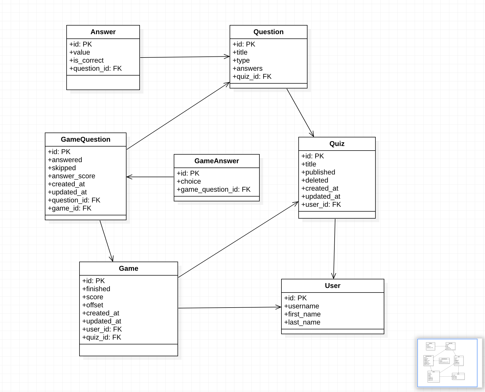
</div>


* After all the steps, you will see swagger documentation, to test all endpoints follow the steps below
  * REGISTER SUPERUSER OR USE init.sh to create superuser(AUTHORIZE)

<div>
  
</div>

#####
<div>
  
</div>

#####

    -- Create a new question

<div>
  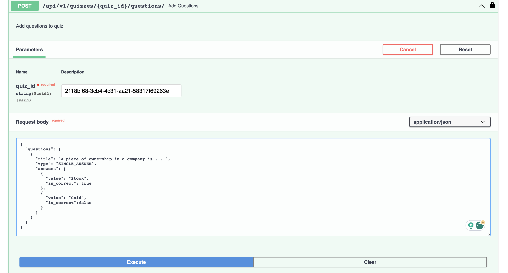
</div>

#####
    -- Create quiz

<div>
  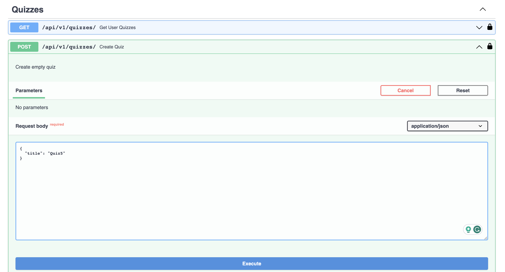
</div>
<div>
  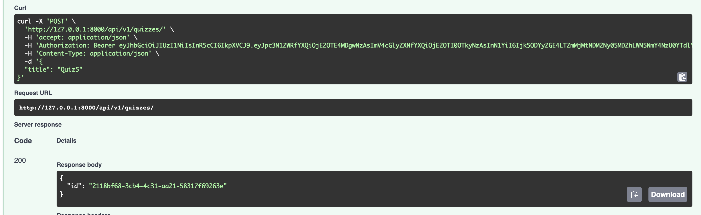
</div>


#####
    -- Publish quiz

<div>
  
</div>

#####
    -- Start Game
<div>
  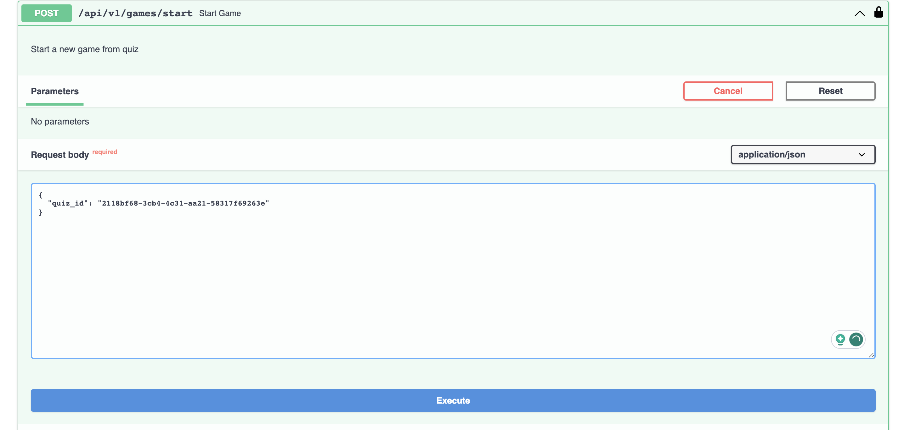
</div>

<div>
  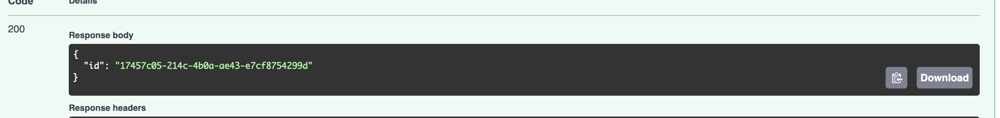
</div>


#####
    -- Next Question
<div>
  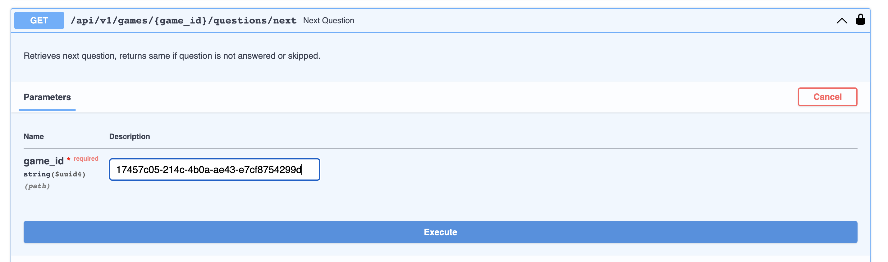
</div>

<div>
  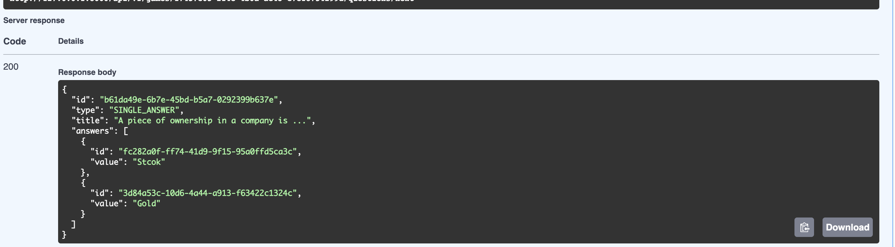
</div>


#####
    -- Submit Answer to Question
<div>
  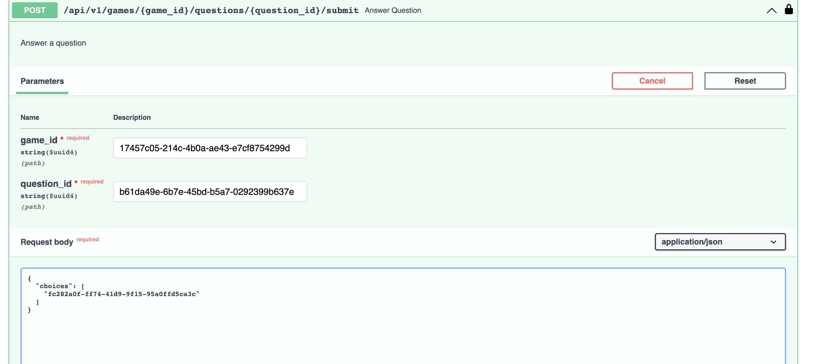
</div>

<div>
  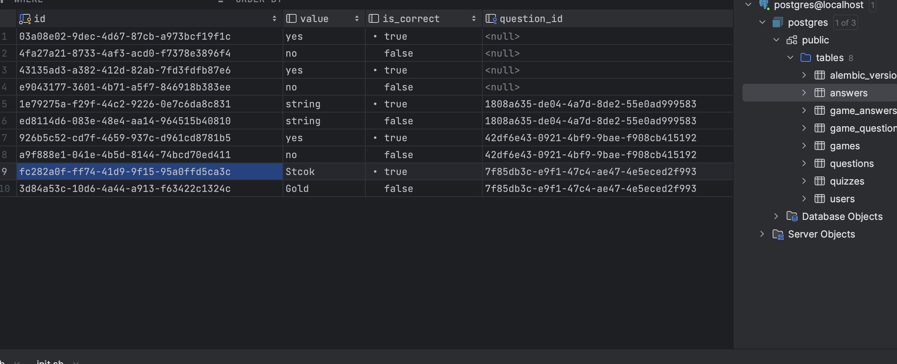
</div>

<div>
  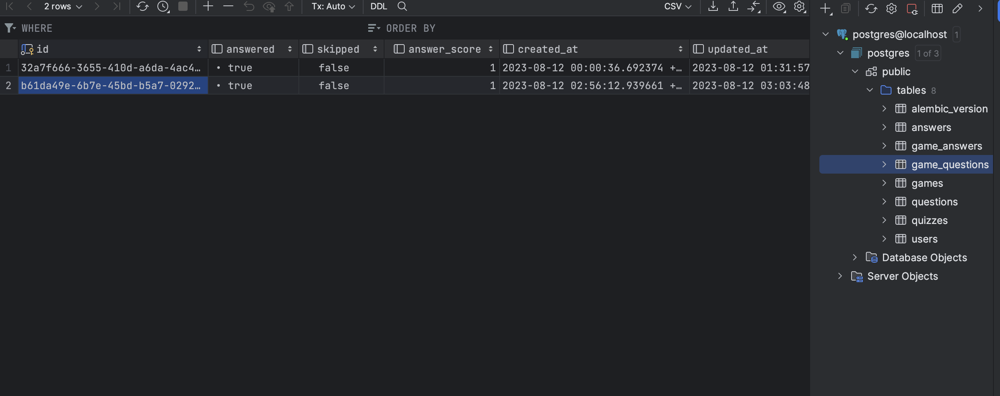
</div>

#####
    -- Finish Quiz by using NEXT
<div>
  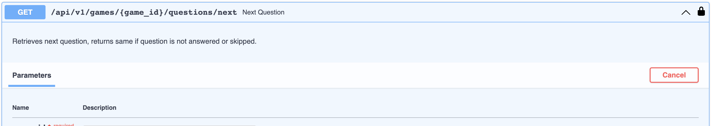
</div>


#####
    -- Check your answers
<div>
  
</div>

<div>
  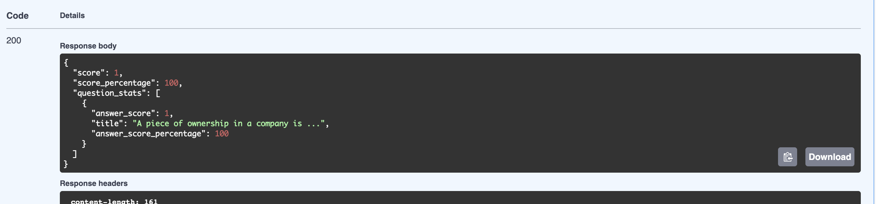
</div>

